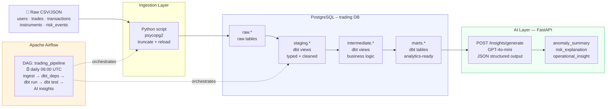

# AI Data Pipeline Lab

> **End-to-end AI-ready data engineering pipeline for fintech trading data.**  
> Ingestion → dbt transformations → Airflow orchestration → OpenAI-powered insights.  
> Built to bridge the gap between raw event data and AI-consumable analytics datasets.

---

## What this project does

This lab simulates the data platform of a regulated fintech trading company.  
Raw trading events (trades, transactions, risk alerts) flow through a full production-grade pipeline:

1. **Ingestion** — CSV/JSON sources are loaded into PostgreSQL under a dedicated `raw` schema
2. **Transformation** — dbt models clean, type, join and aggregate the data across three layers
3. **Orchestration** — Apache Airflow schedules and monitors every step as a DAG
4. **AI Insights** — A FastAPI service reads the mart tables and calls OpenAI GPT-4o-mini to generate anomaly summaries, risk explanations and operational recommendations

---

## Architecture



---

## Tech stack

| Layer | Technology |
|---|---|
| **Warehouse** | PostgreSQL 16 |
| **Transformation** | dbt-core + dbt-postgres · dbt_utils |
| **Orchestration** | Apache Airflow 2.9 (LocalExecutor) |
| **AI Insights** | FastAPI · OpenAI GPT-4o-mini |
| **Containerisation** | Docker · Docker Compose |
| **Language** | Python 3.11 |

---

## Project structure

```
ai-data-pipeline-lab/
├── docker-compose.yml          # All services: postgres, airflow, ai-layer
├── Makefile                    # Developer shortcuts
├── .env.example                # Environment variable template
│
├── docker/
│   ├── postgres/init.sql       # Creates trading + airflow databases
│   └── airflow/Dockerfile      # Airflow 2.9 + dbt-postgres
│
├── data/raw/                   # Source CSV datasets (fintech simulation)
│   ├── users.csv               # 10 users across 5 countries
│   ├── instruments.csv         # 10 instruments (equity, forex, crypto, ETF)
│   ├── trades.csv              # 50 trades Jan–May 2026
│   ├── transactions.csv        # 53 transactions (settlements + deposits)
│   └── risk_events.csv         # 20 compliance / risk events
│
├── ingestion/
│   └── load_raw.py             # Idempotent CSV → PostgreSQL loader
│
├── dbt/
│   ├── dbt_project.yml         # Project config + schema mapping
│   ├── profiles.yml            # Connection profiles (env_var interpolation)
│   ├── packages.yml            # dbt_utils dependency
│   ├── macros/
│   │   └── generate_schema_name.sql  # Clean schema names (no prefix)
│   └── models/
│       ├── sources.yml         # Source declarations with column tests
│       ├── staging/            # 5 views: typed, cleaned, normalised
│       ├── intermediate/       # 2 views: business logic joins + aggregates
│       └── marts/              # 2 tables: customer_activity, risk_signals
│
├── airflow/
│   └── dags/
│       └── trading_pipeline_dag.py  # Main orchestration DAG
│
└── ai_layer/
    ├── main.py                 # FastAPI app (3 endpoints)
    ├── Dockerfile
    └── services/
        ├── data_reader.py      # PostgreSQL mart reader
        └── insight_generator.py # OpenAI GPT-4o-mini call
```

---

## Quick start

### Prerequisites
- Docker + Docker Compose v2
- (Optional) OpenAI API key for live AI insights

### 1 — Configure environment

```bash
cp .env.example .env
# Edit .env and set your OPENAI_API_KEY
```

### 2 — Start all services

```bash
make up
# or: docker compose up -d
```

This starts:
- **PostgreSQL** on port `5432` (creates `trading` and `airflow` databases)
- **Airflow webserver** on port `8080` (admin / admin)
- **Airflow scheduler**
- **AI insights layer** on port `8001`

First startup takes ~3 minutes (image builds + Airflow DB migration).

### 3 — Trigger the pipeline

```bash
make trigger-dag
# or open http://localhost:8080 → DAGs → trading_pipeline → Trigger
```

The pipeline runs these tasks in order:

| # | Task | What it does |
|---|------|-------------|
| 1 | `ingest_raw_data` | Loads all 5 CSVs into `trading.raw.*` |
| 2 | `dbt_deps` | Installs dbt_utils package |
| 3 | `run_dbt_models` | Builds staging → intermediate → mart models |
| 4 | `run_dbt_tests` | Runs 30+ data quality tests (gate: fails DAG on error) |
| 5 | `generate_ai_summary` | Calls AI layer → GPT-4o-mini → structured insights |

### 4 — Query results

```bash
# Customer activity mart
make psql-marts

# Risk signals mart
make psql-risk

# Or open psql directly
make psql
```

### 5 — Get AI insights

```bash
# Check the service
make ai-health

# Trigger insights (requires OPENAI_API_KEY)
make ai-insights
```

Example response:
```json
{
  "anomaly_summary": "User U006 (Amara Okafor) shows a pattern of rapid crypto accumulation — 4 buy events in 30 days with 2 high-severity risk flags. User U003 (James Wilson) has 2 compliance flags and a pending large BTC order still open.",
  "risk_explanation": "Two users are in 'critical' risk tier: U006 (risk score 75) and U003 (risk score 65). U006 has exceeded the crypto concentration limit twice. U003's open BTC position is under compliance review.",
  "operational_insight": "Recommend immediate manual review of U006 and U003. Freeze further crypto buys for U006 pending compliance sign-off. Consider implementing automated position-size circuit breakers for crypto assets given 4 of the top 5 risk events are crypto-related.",
  "model": "gpt-4o-mini",
  "generated_at": "2026-05-28T10:00:00+00:00"
}
```

---

## dbt model layers

### Staging (`trading.staging.*`)
One model per source table. Responsibilities: rename columns, cast types, lowercase categoricals, exclude null PKs.

| Model | Source | Key derivations |
|---|---|---|
| `stg_trades` | `raw.raw_trades` | `notional_value = quantity × price`, typed `traded_at` |
| `stg_users` | `raw.raw_users` | email/country normalised |
| `stg_instruments` | `raw.raw_instruments` | symbol uppercased |
| `stg_transactions` | `raw.raw_transactions` | `trade_id` nullable (deposits) |
| `stg_risk_events` | `raw.raw_risk_events` | `trade_id` nullable |

### Intermediate (`trading.intermediate.*`)
Business logic joins. Not exposed directly to BI tools.

| Model | What it computes |
|---|---|
| `int_trading_volume` | Daily buy/sell counts, total notional, price range per instrument |
| `int_customer_activity` | Per-user totals: trades, notional, fees, deposits, net P&L, days span |

### Marts (`trading.marts.*`)
Materialised as **tables**. Primary output for BI, dashboards and the AI layer.

| Model | Key columns |
|---|---|
| `mart_customer_activity` | `customer_segment`, `net_pnl_estimate`, `total_risk_events`, `high_risk_events` |
| `mart_risk_signals` | `risk_tier` (critical/elevated/moderate/low), `risk_score` (0-100) |

---

## Data quality tests

dbt tests run as step 4 of the pipeline and act as a **data quality gate** — the DAG fails if any test fails.

| Test type | Count | Examples |
|---|---|---|
| `not_null` | 15+ | All primary keys, all severity fields |
| `unique` | 10+ | PKs on every staging and mart model |
| `accepted_values` | 8 | `trade_type`, `status`, `risk_profile`, `severity`, `risk_tier`, `customer_segment` |
| `relationships` | 4 | `stg_trades → stg_users`, `stg_trades → stg_instruments`, `stg_transactions → stg_users`, `stg_risk_events → stg_users` |

---

## Portfolio value / real-world applicability

| Capability demonstrated | Why it matters |
|---|---|
| **Airflow DAG orchestration** | Production-standard scheduling, retries, task dependencies, logging |
| **dbt multi-layer modelling** | Staging / intermediate / mart separation — standard at data-mature companies |
| **dbt tests as data quality gates** | Prevents bad data from reaching BI or AI layers |
| **AI-ready dataset design** | Marts are structured specifically to be consumed by LLMs without prompt injection risk |
| **OpenAI structured output** | `response_format: json_object` guarantees parseable AI responses |
| **Graceful degradation** | Pipeline works without OpenAI key; AI layer returns mock if DB is empty |
| **Docker-first** | Entire stack runs with a single `make up` — reproducible on any machine |
| **Security baseline** | Non-root Docker user, parameterised SQL (no injection), secrets via env vars |

---

## Environment variables reference

| Variable | Default | Description |
|---|---|---|
| `POSTGRES_USER` | `trading` | Trading DB user |
| `POSTGRES_PASSWORD` | `trading` | Trading DB password (change in prod) |
| `POSTGRES_DB` | `trading` | Trading database name |
| `OPENAI_API_KEY` | _(empty)_ | OpenAI key — service works without it (mock mode) |
| `OPENAI_MODEL` | `gpt-4o-mini` | Model used by insight_generator |
| `AIRFLOW_ADMIN_USER` | `admin` | Airflow UI username |
| `AIRFLOW_ADMIN_PASSWORD` | `admin` | Airflow UI password |
| `AIRFLOW_SECRET_KEY` | _(required)_ | Airflow webserver secret — change in production |

---

## Useful commands

```bash
make up               # Start all services
make down             # Stop services
make clean            # Stop + delete all volumes (full reset)
make trigger-dag      # Manually run the pipeline
make dbt-run          # Run dbt models directly (inside Airflow container)
make dbt-test         # Run dbt tests directly
make psql             # psql into the trading database
make psql-marts       # Query mart_customer_activity
make psql-risk        # Query mart_risk_signals
make ai-health        # Check AI service liveness
make ai-insights      # Generate fresh AI insights
make logs             # Tail all container logs
```

---

## Roadmap / extensions

- [ ] Add AWS S3 as ingestion source (replace local CSVs)
- [ ] BigQuery target profile for dbt (cloud warehouse)
- [ ] Grafana dashboard connected to mart tables
- [ ] LangChain conversational interface over the mart data ("how many high-risk users traded crypto this week?")
- [ ] dbt snapshots for Type 2 slowly-changing dimensions (user risk profile history)
- [ ] CI/CD with GitHub Actions: `dbt compile` + `dbt test` on every PR

---

## Author

**Tendresse Dutra** — AI Engineer · Data Engineer  
[github.com/tdutra-dev](https://github.com/tdutra-dev) · [linkedin.com/in/tendresse-dutra](https://linkedin.com/in/tendresse-dutra)
